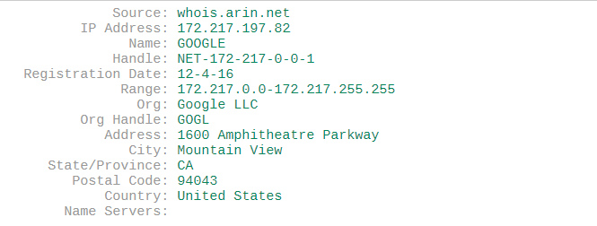
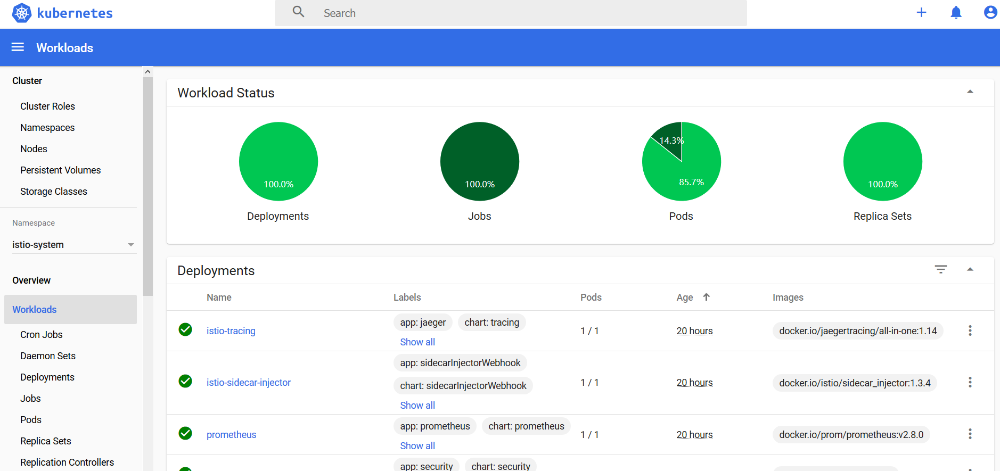
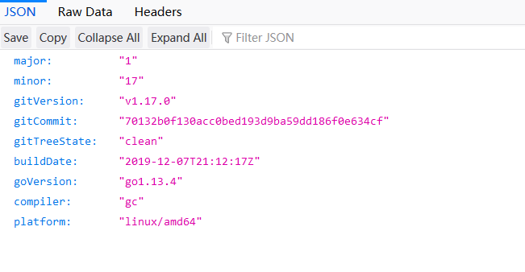

# [Cloud开发笔记本](../README.md)

## Microk8s安装及Kubernetes Dashboard配置

### 1. Microk8s安装

如果选择下载ubuntu iso作为系统镜像，则安装时会提供microk8s选项，选择安装即可；如果使用multipass或其他方式生成虚拟机，则需要单独安装microk8s，命令如下：

```
sudo snap install microk8s --classic
```

如果安装过程中由于网速太慢导致失败，可以下载所需文件离线安装，离线安装命令如下：

```
sudo snap download microk8s
sudo snap ack microk8s_1107.assert
sudo snap install microk8s_1107.snap --classic
```

### 2. 启用Microk8s Addons

Microk8s提供了丰富的Addon供我们使用，本文档将使用DNS，Dashboard来演示Microk8s的基本使用，使用命令之前首先赋予microk8s `sudo`权限,然后执行以下命令：

```
microk8s.enable dns dashboard
sudo snap alias microk8s.kubectl kubectl
```

通过以上命令启用dns和dashboard，并通过`snap alias`简化内置的`kubectl`命令，和`microk8s.kubectl`一样，我们可以通过相同的方式来使用microk8s内置的`helm`和`istioctl`命令。

### 3. 配置Dashboard服务

Kubernetes Dashboard开发小组为了保证安全性在服务内部设置了检查，通常情况下是不允许在外部设备访问Kubernetes Dashboard的，即使能够访问页面，也无法登录成功。但我们可以通过添加`NodePort`类型的服务来实现在主机中访问虚拟机Kubernetes Dashboard。配置如下所示：

```
apiVersion: v1
kind: Service
metadata:
  name: kubernetes-dashboard-nodeport
  labels:
    k8s-app: kubernetes-dashboard-nodeport
  namespace: kube-system
spec:
  selector:
    k8s-app: kubernetes-dashboard
  ports:
  - port: 6443
    targetPort: 8443
    nodePort: 32154
  type: NodePort
```

由于网络问题会导致相关镜像下载失败，我们通常会使用VPN进行镜像下载，虚拟机VPN的配置方式将在最后介绍。这里提供一个无需VPN的配置方式：

在/etc/hosts中添加以下内容：
```
172.217.197.82 k8s.gcr.io
```



以上配置可满足Kubernetes基本镜像下载需求，可在添加前可以自行通过`ping`命令查看能否连通。

### 4. 配置Nginx

接下来我们在虚拟机中安装Nginx并配置端口监听使主机可以访问Kubernetes Dashboard。

1. 首先安装Nginx
    ```
    sudo apt update
    sudo apt install nginx
    ```
2. 为Nginx生成证书
    ```
    sudo openssl req -x509 -nodes -days 365 -newkey rsa:2048 -keyout nginx.key -out nginx.crt
    ```
3. 在本github中找到并下载[nginx.conf](../sources/nginx.conf)
4. 替换nginx.conf中的证书和密钥文件并重启Nginx

没有直接使用`80`或者`443`端口的原因是在之后如果启动ingress或者istio会出现端口冲突。另外，可以从配置文件中看到配置了`http://localhost:8001`，该地址为`kubectl proxy`启动后的默认地址，可用于查看Kubernetes的API。

### 5. 查看效果

* Kubernetes Dashboard


* Kubernetes APIs


### 6. VPN配置

VPN配置分为两种方式。

* 一种是单独为Microk8s设置连接主机VPN，方式如下：

    直接编辑`/var/snap/microk8s/1107/args/containerd-env`或查找使用命令查找`find / -iname containerd-env`添加以下配置并保存，然后重启Microk8s。
    ```
    HTTPS_PROXY=http://${your_proxy_host}:${your_proxy_port}
    HTTP_PROXY=http://${your_proxy_host}:${your_proxy_port}
    NO_PROXY="localhost,127.0.0.1,..."
    ```

* 为虚拟机配置连接主机VPN，方式如下：

    编辑`/etc/environment`并将上述代理配置添加到该文件，保存之后重启网络或系统。为了防止大小写差异可以使用以下配置：
    ```
    HTTPS_PROXY=http://${your_proxy_host}:${your_proxy_port}
    HTTP_PROXY=http://${your_proxy_host}:${your_proxy_port}
    NO_PROXY="localhost,127.0.0.1,..."
    https_proxy=http://${your_proxy_host}:${your_proxy_port}
    http_proxy=http://${your_proxy_host}:${your_proxy_port}
    no_proxy="localhost,127.0.0.1,..."
    ```
